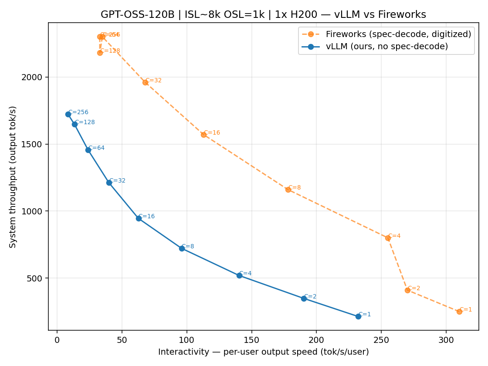
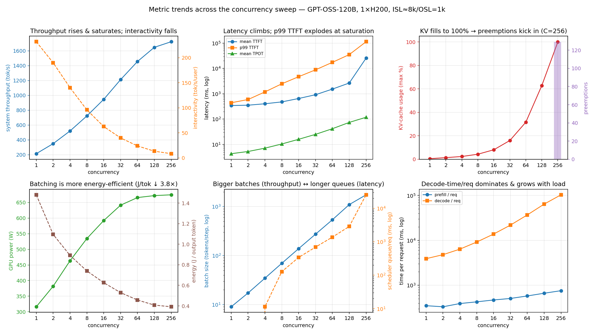
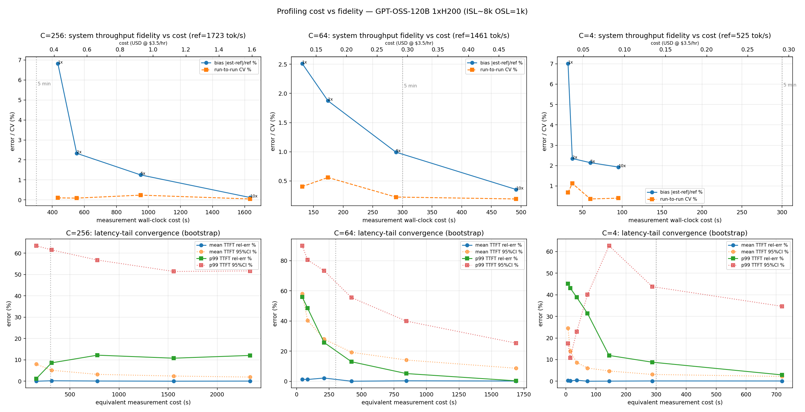
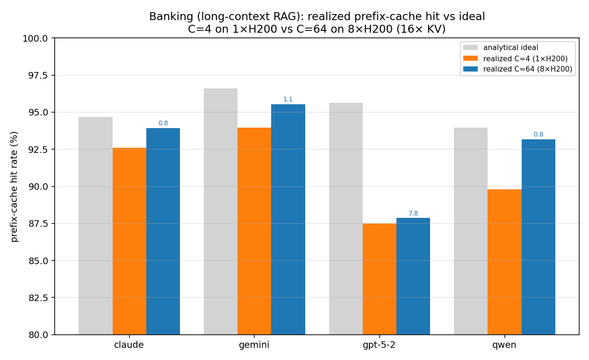
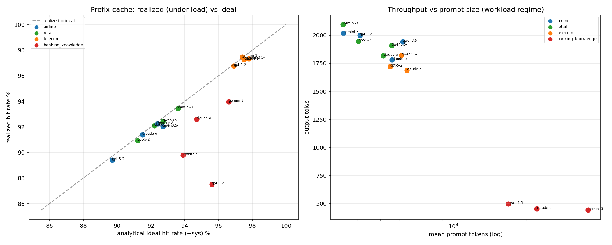
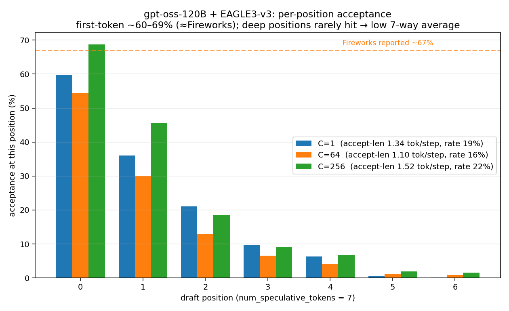
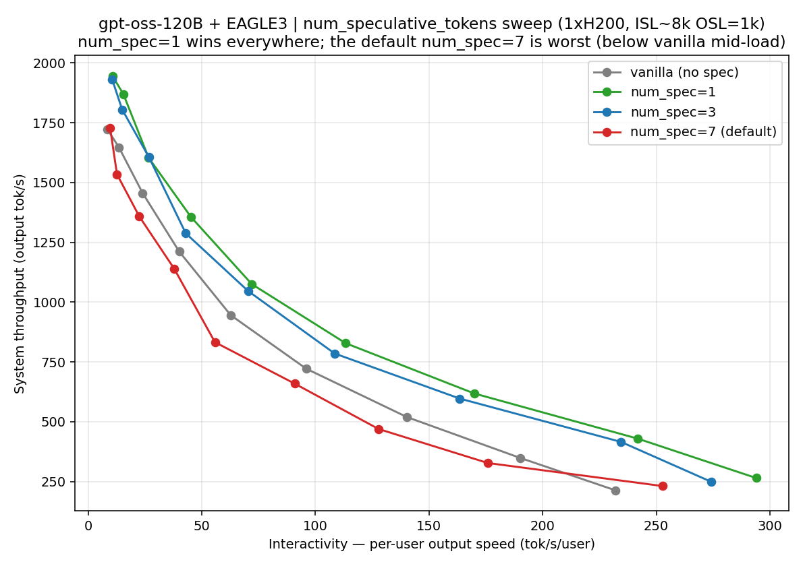

# vLLM Inference Profiling on H200 — Experiments & Findings

Four experiments profiling **gpt-oss-120b (FP4)** served by **vLLM v0.22** on **NVIDIA H200**
(Nebius): (1) how our serving compares to Fireworks, (2) a full metric sweep across load,
(3) how cheaply we can benchmark without losing accuracy, and (4) how prefix caching behaves on
a realistic agent workload. Plots are embedded; raw data + re-runnable scripts in `nebius/`
(setup in `PROFILING_RUNBOOK.md`). Unfamiliar terms are defined in the [glossary](#glossary).

## Summary

- **vs Fireworks (§1):** at matched concurrency our vLLM serves gpt-oss-120b at **~60–75% of
  Fireworks' throughput and per-user speed**. Enabling **speculative decoding (EAGLE3) did *not*
  close it** — acceptance is only ~15–22% on this random-token workload (vs Fireworks' 67%), so
  spec ≈ vanilla. But per-position analysis (§5) shows the **23% is a `num_spec=7` averaging
  artifact** — first-token acceptance is ~67% (≈Fireworks); validated by a `num_spec` sweep:
  **`num_spec=1` beats vanilla +10–24% at every load** (the default `num_spec=7` was the *worst*).
- **Load sweep (§2):** throughput **saturates near concurrency 32–64** (+18% from C=64 to C=256);
  **p99 time-to-first-token rises from 0.4 s to 113 s** over C=1→256; KV cache reaches 100% with
  the first preemptions at C=256; **energy per output token falls 3.8×** (1.48→0.39 J) with batching.
- **Cost vs fidelity (§3):** at production-like load (C=256), short benchmarks are **highly
  repeatable** (run-to-run CV <0.25%); the default budget estimates throughput to **0.12%** and
  trimming to ~conc×5 (~16 min) still gives **~1.3%**, while **p99 tail latency stays ~6–15%**.
- **Realistic workload (§4):** realized prefix-cache hit rate **equals the analytical ideal within
  <1%** for light/medium chat; for long-context RAG it was 2–8% lower at C=4 on 1×H200,
  **narrowing to <1.1% for 3 of 4 workloads at C=64 on 8×H200** (16× the KV memory).
- **Real-token replay (§5):** replaying the *actual* tau-bench prompts **confirms the cache hit
  (~94%, ≈ synthetic)**. Spec acceptance stays ~23% — but per-position analysis shows that's a
  **`num_spec=7` averaging artifact: first-token acceptance is ~67%** (≈Fireworks), so the draft is
  fine — and a `num_spec` sweep **validated the fix**: `num_spec=1` is optimal (**+10–24% over
  vanilla** at every load), while the default `num_spec=7` was the worst (below vanilla mid-load).

---

## 1. vLLM vs Fireworks — throughput vs interactivity

**Finding: our vanilla vLLM trails Fireworks by ~1.3–1.6× on *both* axes at every load level.**

Each point is a concurrency level. **X = interactivity** (how fast one user receives tokens,
tok/s/user); **Y = system throughput** (total output tok/s). Higher-and-righter is better; the
curve is the throughput-vs-latency trade-off.

| concurrency | ours: interactivity | ours: throughput | Fireworks: interactivity | Fireworks: throughput |
|--:|--:|--:|--:|--:|
| 1 | 232 | 214 | 310 | 250 |
| 2 | 190 | 349 | 270 | 410 |
| 4 | 140 | 520 | 255 | 800 |
| 8 | 96 | 722 | 178 | 1,160 |
| 16 | 63 | 946 | 113 | 1,570 |
| 32 | 40 | 1,212 | 68 | 1,960 |
| 64 | 24 | 1,455 | 35 | 2,300 |
| 128 | 13.5 | 1,647 | 33 | 2,180 |
| 256 | 8.5 | 1,722 | 33 | 2,300 |

(interactivity in tok/s/user; throughput in output tok/s.)

**Why the gap — and does speculative decoding close it?** Fireworks runs **speculative decoding**
(~67% draft acceptance), which lifts both axes. We tested it directly by re-running the sweep with
**vLLM + EAGLE3** (`nvidia/gpt-oss-120b-Eagle3-v3`, 7 draft tokens) — the **green curve above**.
**It did *not* close the gap.** On this random-token workload EAGLE3 acceptance is only **~15–22%**
(vs Fireworks' 67%), so spec decoding ≈ vanilla — in fact slightly *worse* at mid concurrency,
where the draft/verify overhead isn't recouped and the GPU is already compute-bound:

| C | vanilla tput | +EAGLE3 tput | EAGLE3 acceptance |
|--:|--:|--:|--:|
| 1 | 214 | 231 | 19% |
| 8 | 722 | 660 | 19% |
| 64 | 1,455 | 1,358 | 16% |
| 256 | 1,722 | 1,727 | 22% |

So the gap is **not** simply spec-on/off. Two follow-ups (§5) explain what's going on. (1) Real
traffic doesn't raise the ~23% headline acceptance — but (2) decomposing it **by draft position**
shows the headline is misleading: **first-token acceptance is ~67%, matching Fireworks** — the
draft head is fine. The low average is a `num_speculative_tokens=7` artifact (deep positions rarely
hit but count in the denominator), so the real fixes are a **shallower `num_spec`** and the draft
overhead under batching — not the workload, and not a weak draft. Secondarily, at high load our
single H200 is queue-bound (§2).

> *Fair-comparison note:* our harness already matches Fireworks' protocol — exactly OSL output
> tokens (`ignore_eos`), `conc×2` warmup discarded + `conc×10` measured. Independent cross-check:
> their reported vLLM C=4 wall time (105 s) equals ours. Fireworks points are digitized from their
> report (can swap in exact values if shared).

---

## 2. Metric sweep across load (concurrency 1 → 256)

**Finding: throughput saturates at C≈32–64; past that, extra load buys almost no throughput but
makes latency explode.** We capture ~30 metrics/run (client + vLLM `/metrics` + GPU + logs; see
`METRICS.md`). The six panels summarize the trend; full numbers in the tables below.

- **Throughput vs interactivity** — throughput climbs then flattens (+18% from C=64→256 for 8×
  the load); per-user speed falls steadily. The **Pareto knee is C≈32–64**.
- **Latency degrades, tails first** — p99 time-to-first-token goes 0.4 s → 113 s (C=1→256);
  per-token latency 4 → 118 ms. **Tail TTFT is the earliest saturation alarm** (already >17 s at C=64).
- **KV-cache pressure appears only at the top** — cache usage hits 100% at C=256, triggering the
  first **preemptions** (129 requests evicted & recomputed); 0 below that.
- **Batching is what buys throughput — and costs latency** — tokens processed per step grows
  9 → 1,736 (~190×); the flip side is scheduler queue time 0 → 25 s.
- **Higher load is more energy-efficient** — **1.48 → 0.39 J per output token (3.8×)** as power
  rises to 96% of the 700 W TDP. The perf-per-watt case for batching.

<b>Per-metric detail — every metric's trend (click to expand)</b>

- **System throughput** — rises steeply to C≈32, then flattens: +18% from C=64→256 (1,455→1,722) for an 8× concurrency increase. The Pareto knee is C≈32–64.
- **Interactivity (per-user speed)** — monotonic decline, ~halving every ~4× concurrency (232→8.5).
- **mean TTFT** — flat (<1 s) up to C=32, then blows up (25.5 s at C=256); first thing users feel when the box saturates.
- **p99 TTFT** — blows up earlier and harder (441 ms → 113 s); the most sensitive saturation signal (>17 s already at C=64).
- **mean TPOT / ITL** — rise ~27× (4.3→118 ms) as the decode batch shares the GPU; ITL≈TPOT ⇒ decode is steady, not bursty.
- **KV-cache usage** — climbs to 100% only at C=256; headroom below that. Hitting the ceiling triggers preemptions.
- **Preemptions** — exactly 0 until KV saturates, then 129 at C=256; a direct KV-pressure / over-subscription alarm.
- **Prefill time/req** — sublinear (351→758 ms); prefill is compute-bound and batches efficiently.
- **Decode time/req** — explodes (3.9 s → 104 s); the dominant component of end-to-end latency under load.
- **Queue time/req** — 0 → 25 s; requests waiting for a scheduler slot — the other half of the TTFT blowup.
- **Batch size (tokens/step)** — 9 → 1,736 (~190×); the mechanism that buys throughput, and why energy/token falls.
- **GPU power** — 316 → 674 W (96% of the 700 W TDP); tracks utilization, useful for perf-per-watt & thermal budgeting.
- **GPU utilization** — 80% at C=1, 98% at C=256; the H200 is well-fed even at low load (120B model).
- **Energy/token** — 1.48 → 0.39 J/tok (3.8× more efficient); strongest argument for higher concurrency, latency budget permitting.

<b>Full per-concurrency tables (click to expand)</b>

**Throughput & latency**

| C | throughput (tok/s) | interactivity (tok/s/user) | mean TTFT (ms) | p99 TTFT (ms) | mean TPOT (ms) |
|--:|--:|--:|--:|--:|--:|
| 1 | 214 | 232 | 343 | 441 | 4.3 |
| 2 | 349 | 190 | 354 | 592 | 5.3 |
| 4 | 520 | 140 | 403 | 1,183 | 7.1 |
| 8 | 722 | 96 | 477 | 2,469 | 10.4 |
| 16 | 946 | 63 | 650 | 4,714 | 16.0 |
| 32 | 1,212 | 40 | 916 | 8,795 | 25.0 |
| 64 | 1,455 | 24 | 1,526 | 17,368 | 41.7 |
| 128 | 1,647 | 13.5 | 2,656 | 35,112 | 74.0 |
| 256 | 1,722 | 8.5 | 25,547 | 113,217 | 118.3 |

**Scheduler / memory / hardware / efficiency**

| C | KV usage max (%) | preemptions | prefill/req (ms) | decode/req (ms) | queue/req (ms) | batch (tok/step) | power (W) | GPU util (%) | energy (J/tok) |
|--:|--:|--:|--:|--:|--:|--:|--:|--:|--:|
| 1 | 0.5 | 0 | 351 | 3,914 | 0 | 9 | 316 | 80 | 1.48 |
| 2 | 1.4 | 0 | 332 | 4,804 | 0 | 17 | 382 | 85 | 1.10 |
| 4 | 2.4 | 0 | 392 | 6,377 | 11 | 35 | 463 | 88 | 0.89 |
| 8 | 4.3 | 0 | 428 | 9,185 | 128 | 69 | 534 | 91 | 0.74 |
| 16 | 8.1 | 0 | 471 | 13,819 | 341 | 139 | 592 | 92 | 0.63 |
| 32 | 16.0 | 0 | 509 | 21,896 | 693 | 273 | 641 | 95 | 0.53 |
| 64 | 31.6 | 0 | 578 | 36,903 | 1,376 | 537 | 665 | 96 | 0.46 |
| 128 | 62.9 | 0 | 665 | 64,304 | 2,866 | 1,095 | 672 | 97 | 0.41 |
| 256 | 100.0 | 129 | 758 | 103,600 | 25,349 | 1,736 | 674 | 98 | 0.39 |

*Prefix-cache hit and spec-decode read 0 / n-a here by design (random tokens, no draft model);
both come alive in §4.*

---

## 3. How cheaply can we benchmark? (cost vs fidelity)

**Finding (at production-like load, C=256): short benchmarks are highly repeatable (run-to-run
CV <0.25%); the default budget nails throughput to 0.12%, and trimming to ~conc×5 (~16 min) still
gives ~1.3%. Mean latency converges immediately; only p99 tail latency stays noisy (~6–15%).**

**Method.** Two metric types behave differently, so each is measured appropriately:
- **System throughput** is a property of a real wall-clock window, so we run each budget
  (`num_prompts = B×conc`) as **5 independent repeats** against a warm server and compare to a long
  ground-truth run (`conc×40`). *bias* = |mean − ground_truth| / ground_truth; *run-to-run CV* =
  std/mean across the 5 repeats (≈ the noise of re-running the same short benchmark).
- **Latency percentiles** are per-request, so we **bootstrap** the ground-truth run's per-request
  TTFT array (resample N requests, recompute, ×300) — the sampling error of a budget-N measurement
  without paying for N separate runs. ("Cost" = N / completion-rate, the measured-window equivalent;
  the throughput table's cost is the full repeated-run wall-clock, which also includes warmup.)

**System throughput — repeatable; default budget is accurate** (C=256, ground truth = 1,723 tok/s):

| budget | ≈ cost | throughput bias | run-to-run CV |
|---|--:|--:|--:|
| conc×1 | ~7 min | 6.8% | 0.10% |
| conc×2 | ~9 min | 2.3% | 0.09% |
| conc×5 | ~16 min | 1.3% | 0.24% |
| **conc×10 (InferenceX default)** | **~27 min** | **0.12%** | **0.05%** |

**Latency — mean converges instantly; p99 tail stays noisy** (C=256, bootstrap; ground truth =
3,840 requests, mean TTFT 25.0 s, p99 TTFT 67.5 s):

| budget | ≈ cost | mean TTFT error | p99 TTFT error |
|---|--:|--:|--:|
| conc×1 | ~2.6 min | 0.2% | 5.5% |
| conc×2 | ~5.2 min | 0.1% | 5.9% |
| conc×5 | ~13 min | 0.0% | 14.6% |
| conc×10 | ~26 min | 0.0% | 12.1% |

**Takeaways:**
- **The default budget is reliable at production load** — 0.12% throughput bias, CV <0.1%. Trimming
  to ~conc×5 (~16 min) still gives ~1.3%; below that (conc×1–2) throughput drifts to 2–7%.
- **Tail latency is the noisy one** — mean TTFT is exact almost immediately, but p99 stays ~6–15%
  (the absolute p99 of 67 s at C=256 is a saturation artifact dominated by a few extreme-queue
  requests). Report p99 with that caveat.
- **Policy:** at production load keep ~conc×5–10; the larger cost cuts (2–4×) and the p99 bottleneck
  show up at lower concurrency (below).

<b>Lower load (C=64, C=4) — bigger cost cuts, but p99 becomes the bottleneck (click to expand)</b>

**C=64 throughput** (ground truth = 1,461 tok/s):

| budget | ≈ cost | throughput bias | run-to-run CV |
|---|--:|--:|--:|
| conc×1 | ~2.2 min | 2.5% | 0.4% |
| conc×2 | ~2.9 min | 1.9% | 0.6% |
| conc×5 | ~4.8 min | 1.0% | 0.2% |
| conc×10 (default) | ~8.2 min | 0.35% | 0.19% |

*(C=4 is similar from ~1 min: conc×10 → 1.9% bias; only the tiny conc×1 run is noisy at 7%.)*

**C=64 latency tails** (bootstrap; ground truth = 2,560 requests, mean TTFT 718 ms, p99 TTFT 11.6 s):

| budget | ≈ cost | mean TTFT error | p99 TTFT error |
|---|--:|--:|--:|
| conc×1 | ~42 s | 1.3% | 57% |
| conc×2 | ~84 s | 1.1% | 51% |
| conc×5 | ~3.5 min | 0.3% | 27% |
| conc×10 | ~7 min | 0.1% | 13% |

At C=64, throughput is cheap (within ~1% in <5 min → cells can be cut 2–4×), but **p99 TTFT is the
cost driver** — still 13% off even at the default. The contrast with C=256: tail fidelity tracks
the absolute **request count**, so the saturated regime (4× more requests per budget) actually
estimates p99 more readily, while throughput there needs a bit more budget to settle.

---

## 4. Realistic workload — does prefix caching deliver? (tau-bench replay)

We replayed real agent traffic (Sierra τ-bench) — **16 model×domain workloads, prefix caching
ON** — to test whether vLLM realizes the *theoretical-best* cache hit rate the workload allows.
(Replay mechanics in [end-notes](#how-the-tau-bench-replay-works).)

**Finding 1 — on normal chat, vLLM realizes ~the ideal cache rate.** Airline/retail/telecom land
**within <1% of the analytical ideal** across all 4 source workloads. Prefix caching "just works."

**Finding 2 — long-context RAG fell 2–8% short, but that's a memory limit, not a caching flaw.**
On one H200, banking's huge contexts (17–62k tokens) crowd the cache → eviction. Re-running
banking at **C=64 on 8×H200 (16× cache memory) closed the gap** for 3 of 4 workloads:

| banking workload | ideal | realized @ C=4 (1×H200) | realized @ C=64 (8×H200) | gap: C=4 → C=64 |
|---|--:|--:|--:|--:|
| claude-opus-4-5 | 94.7 | 92.6 | 93.9 | 2.1% → **0.8%** |
| gemini-3-pro | 96.6 | 94.0 | 95.5 | 2.6% → **1.1%** |
| qwen3.5 | 93.9 | 89.8 | 93.2 | 4.1% → **0.8%** |
| gpt-5-2 | 95.6 | 87.5 | 87.9 | 8.1% → **7.8%** |

Higher concurrency *narrowed* the gap (the opposite of what we expected) — confirming the C=4
shortfall was **single-GPU memory pressure, not concurrency**. Only **gpt-5-2** stays ~8% off:
its contexts (62k mean, 271k max) exceed gpt-oss's 128k window, so they can't be fully cached at
any scale. *Fix for long-context serving: more KV memory (more GPUs / tensor-parallel).*

The 8×H200 also clears banking's **throughput** bottleneck: at C=64 it sustains **2,300–3,400
output tok/s** (claude 2,316 / gemini 2,667 / gpt-5-2 2,819 / qwen 3,435) at 160–416 ms p95 TTFT —
**~5–7× the ~450 tok/s** of the KV-bound C=4 single-H200 run.

**Finding 3 — two throughput regimes, ~4× apart (single H200):** light chat sustains
**~1,700–2,100 tok/s** at ~150–250 ms TTFT; long-context RAG drops to **~450 tok/s** (prefill-bound)
at ~280–410 ms — though 8×H200 lifts the latter to multiple thousand tok/s (above).

<b>All 16 workloads — realized vs ideal cache hit, throughput, latency (click to expand)</b>

| domain | source workload | realized hit | ideal | gap | throughput (tok/s) | TTFT p95 (ms) |
|---|---|--:|--:|--:|--:|--:|
| airline | claude-opus-4-5 | 0.914 | 0.915 | 0.1 | 1,782 | 232 |
| airline | gemini-3-pro | 0.922 | 0.924 | 0.2 | 2,018 | 148 |
| airline | gpt-5-2 | 0.894 | 0.897 | 0.3 | 1,998 | 199 |
| airline | qwen3.5 | 0.920 | 0.927 | 0.7 | 1,943 | 201 |
| retail | claude-opus-4-5 | 0.921 | 0.922 | 0.1 | 1,816 | 244 |
| retail | gemini-3-pro | 0.934 | 0.936 | 0.2 | 2,095 | 146 |
| retail | gpt-5-2 | 0.909 | 0.912 | 0.3 | 1,944 | 192 |
| retail | qwen3.5 | 0.924 | 0.927 | 0.3 | 1,907 | 195 |
| telecom | claude-opus-4-5 | 0.973 | 0.975 | 0.2 | 1,687 | 154 |
| telecom | gemini-3-pro | 0.975 | 0.974 | −0.1 | n/a* | n/a* |
| telecom | gpt-5-2 | 0.968 | 0.969 | 0.1 | 1,721 | 145 |
| telecom | qwen3.5 | 0.973 | 0.978 | 0.5 | 1,821 | 157 |
| banking | claude-opus-4-5 | 0.926 | 0.947 | 2.1 | 453 | 278 |
| banking | gemini-3-pro | 0.940 | 0.966 | 2.6 | 442 | 406 |
| banking | gpt-5-2 | 0.875 | 0.956 | 8.1 | n/a* | n/a* |
| banking | qwen3.5 | 0.898 | 0.939 | 4.1 | 496 | 230 |

\* 2 workloads with extreme outliers (a 65k-token output; a 271k-token input > gpt-oss's 128k
window) crashed the replay client at the end, so client-side latency/throughput is missing; their
server-measured hit rate still landed. (Both client bugs are fixed — see end-notes.)

---

## 5. Real-token replay — does realistic traffic change the spec / cache story?

§1 (spec) and §4 (cache) both used **synthetic** tokens. To check whether *real* content changes
the picture, we rebuilt the replay to send **real prompts** — reconstructed from the actual
tau-bench conversations (agent policy + real dialogue history, from Sierra's public trace bucket) —
and re-ran with **EAGLE3 spec-decode + prefix caching both ON** (telecom, 2 source models,
~4,200 calls each, served by gpt-oss-120B).

| telecom (real prompts) | spec accept: random | real (`/v1/completions`) | real (`/v1/chat`) | **cache hit (real)** | ideal |
|---|--:|--:|--:|--:|--:|
| claude-opus-4-5 | — | 20.7% | 23.2% | **94.5%** | 97.5% |
| gpt-5-2 | ~19% | 22.0% | 23.1% | **94.0%** | 97.5% |

**Cache hit — confirmed on real tokens (~94%, within ~3% of ideal).** Identical to the synthetic
result, exactly as expected: vLLM hashes token-ID *blocks*, so the realized hit rate is structural —
real vs synthetic tokens with the same prefix structure hit the same. Real tokens add no surprise here.

**Spec acceptance — real tokens don't move it (~23%), and that headline number is misleading.**
Acceptance barely changed across three input conditions (random 19% → real-completion 21% →
real-chat 23%), so the input isn't the driver. Decomposing the headline by **draft position**
(we captured `spec_decode_num_accepted_tokens_per_pos`) shows what's really going on:

| draft position | C=1 | C=64 | C=256 |
|---|--:|--:|--:|
| **pos 0 (first token)** | **59.7%** | 54.4% | **68.7%** |
| pos 1 | 36.1% | 30.0% | 45.6% |
| pos 2 | 21.1% | 12.8% | 18.5% |
| pos 3–6 | ≤9.8% | ≤6.5% | ≤9.2% |
| **cumulative capture by pos 2** | 87.5% | 88.5% | 87.2% |

**First-token acceptance is ~60–69% — essentially Fireworks' reported "67%." The EAGLE3 draft head
is *not* weak.** The "23%" is `accepted/draft` **averaged over all 7 draft positions**, and positions
3–6 (which hit ≤10%) still count fully in the denominator, crushing the average. Two things were
conflated:
- **Metric mismatch:** Fireworks' "67%" matches our *first-token* acceptance; our 23% is the 7-way
  average. At the same metric we're comparable.
- **Config:** `num_speculative_tokens=7` is **too deep** — we pay 7 draft passes per step for only
  ~1.3–1.5 accepted tokens (acceptance *length*), so the draft overhead isn't recouped, especially
  under batching. Positions 0–2 give ~87% of the accepts, so a **shallower draft should win** — which
  we then **validated directly** by re-running the §1 sweep at `num_spec ∈ {1, 3, 7}`:

| C | vanilla | **num_spec=1** | num_spec=3 | num_spec=7 (default) |
|--:|--:|--:|--:|--:|
| 1 | 214 | **265 (62%)** | 249 (31%) | 231 (19%) |
| 8 | 722 | **828 (68%)** | 785 (37%) | 660 (19%) |
| 32 | 1,212 | **1,356 (65%)** | 1,288 (36%) | 1,140 (17%) |
| 128 | 1,647 | **1,870 (68%)** | 1,805 (40%) | 1,534 (19%) |
| 256 | 1,722 | **1,946 (64%)** | 1,929 (40%) | 1,727 (22%) |

**Throughput-validated: `num_spec=1` is optimal** — it beats vanilla by **+10–24% at every load**, and
its acceptance *rate* is **62–70%** (≈ Fireworks' 67%, since with 1 draft token the rate *is* the
first-token acceptance — a direct empirical confirmation of the per-position curve). `num_spec=3` is a
close second; the **default `num_spec=7` is the worst** — *below vanilla* at C=8–32, because the deep
draft's overhead isn't recouped. So spec decoding **does** help on this workload — just at
`num_spec=1–2`, not the deep default we first used.

The reasoning-model effect is real but **secondary** — it shows up as a *steeper decay* (pos1 36%,
pos2 21%), not a weak first token. So the earlier "intrinsically low / reasoning model" read was
half-wrong: the draft quality is fine; the culprits were a too-deep `num_spec` and a metric mismatch.

Method &amp; caveat

Real prompts are reconstructed coherent agent text (policy as system, real conversation as history),
re-tokenized by gpt-oss's tokenizer — *not* byte-identical to what the source model saw (different
tokenizer + tool-schema rendering). The chat-endpoint run controls for chat-vs-completion formatting;
the cross-condition consistency (19 / 21 / 23%) makes the conclusion robust. Banking (long-context,
real prompts reach ~38k mean / ~196k max tokens) is an 8×H200 follow-up. Tooling: `extract_real.py`
(trace → real-prompt schedule), `real_client.py` (replay + metric scrape), `real_run.sh`.

---

## Cost & reproducibility

| experiment | hardware | cost |
|---|---|--:|
| §1–2 sweep + §3 cost-fidelity (C=64/C=4) | 1×H200, ~1.7 h | ~$6 |
| §3 C=256 cost-fidelity | 1×H200 | ~$10 |
| §4 tau-bench, 16 workloads | 4× H200 (parallel) | ~$20 |
| §4 banking C=64 re-run | preemptible 8×H200, ~30 min | ~$10 |
| **Total** | | **≈ $45** |

All nodes torn down. Every result is reproducible from `nebius/` (harness `exp_*.sh` / `tau_*.sh`,
analyzers `analyze_*.py` / `plot_*.py`); see `PROFILING_RUNBOOK.md`.

---

## End-notes

### Glossary
- **TTFT** (time-to-first-token) — latency until the user sees the first token (prefill cost).
- **TPOT / ITL** (time-per-output-token / inter-token latency) — the per-token streaming speed.
- **Interactivity** — per-user output speed (tok/s/user) = 1000 / TPOT; "how fast it feels."
- **System throughput** — total output tokens/s across all users.
- **Concurrency (C)** — number of requests served at once (the load level).
- **ISL / OSL** — input / output sequence length (here ≈8k / 1k tokens).
- **Prefix-cache hit rate** — fraction of prompt tokens served from cache instead of recomputed;
  the *ideal* is the analytical maximum the workload's shared-prefix structure allows.
- **KV cache** — GPU memory holding attention state for in-flight requests; when full, vLLM
  **preempts** (evicts & later recomputes) requests.
- **Speculative decoding / MTP** — a small draft model proposes several tokens per step that the
  main model verifies; high acceptance ⇒ more tokens/step ⇒ faster. Fireworks uses it; we don't.

### How the tau-bench replay works
- **Synthetic tokens, not real text.** Serving metrics depend only on *sequence lengths* and
  *prefix-sharing structure*, not token values. From each τ-bench trajectory we keep the shape of
  every call (input len, output len, agent vs. user-simulator, order) and synthesize tokens that
  reproduce the structure — **one shared system block + a per-conversation growing body**. This is
  tokenizer-independent, so it recreates the same cache behavior on any served model.
- **Replay loop.** Each conversation runs **strictly sequentially** (call k+1 only after k →
  append-only prompt keeps the cache warm); **many conversations run concurrently** to load the
  server. Output length is forced (`max_tokens=min_tokens`, `ignore_eos`). Only the server's
  *timing* varies — that's what we measure, vs the analytical ideal in `stats/`.
- **Two "model" roles.** **Source models** (`gpt-5-2`, `claude-opus-4-5`, `gemini-3-pro`,
  `qwen3.5`) define only the *workload shape* (× 4 domains = 16 parts). The **served model**
  actually benchmarked is always **gpt-oss-120b**. Because tokens are synthetic, the served model
  is independent of which source trace is replayed.

### Getting an 8×H200 on Nebius
On-demand 8-GPU is `LOW` in every region (always fails to schedule); **preemptible places**
(flags: `--preemptible-on-preemption stop --recovery-policy fail`). Check live availability with
`nebius capacity resource-advice list --parent-id <tenant>`. Reserved capacity blocks are
console-only.

### Two fixes for the `tau-bench-replay` client (worth upstreaming)
1. **Cache metric mis-named for vLLM ≥0.22** — `client.py` scrapes `vllm:gpu_prefix_cache_*`, but
   the counters are now `vllm:prefix_cache_*`, so its hit-rate returns `None`. (We recovered the
   metric from independent `/metrics` snapshots.)
2. **Client crashes on huge responses** — long-context error/output bodies exceed aiohttp's
   512 KB line limit (`LineTooLong`). Fix: raise `read_bufsize` and make a single failed request
   non-fatal to the run.
